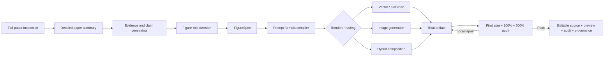

# ResearchFigureSkill

> A prompt-first, evidence-locked compiler for publication figures: understand the whole paper, compile an auditable production prompt, render, inspect the real artifact, and deliver an editable source.

[中文说明](README.zh-CN.md) · [Market landscape](docs/MARKET_LANDSCAPE_2026.md) · [Validation report](docs/VALIDATION_REPORT.md) · [Changelog](CHANGELOG.md) · [Contributing](CONTRIBUTING.md)

ResearchFigureSkill is not a gallery of “clean, professional, Nature-style”
phrases. Its core asset is a reproducible prompt-engineering workflow that
turns a detailed full-paper summary into a renderer-ready visual contract
without weakening, strengthening, or inventing scientific claims.

The default path is:



## Why this workflow matters

The hard part of research illustration is not asking an image model to “draw a
scientific diagram.” It is deciding:

- what the paper actually establishes, including negative evidence and limits;
- whether the figure should explain **WHY**, **HOW**, or **WHETHER**;
- which labels, values, equations, entities, and relations must be exact;
- whether an arrow means data flow, time, association, causality, feedback, or
  containment;
- which parts require deterministic vector or plot code;
- what an image generator may illustrate without becoming evidence;
- whether the rendered artifact contains wrong glyphs, pseudo-text, soft or
  melted shapes, ghosting, clipping, or low-resolution layers.

ResearchFigureSkill makes these decisions explicit, testable, and repairable.

## What is different

| Common approach | ResearchFigureSkill 2.0 |
|---|---|
| Full paper → one improvised image prompt | Full-paper summary → evidence constraints → role decision → compiled prompt |
| Prompt quality measured by length | Twelve named prompt contracts with deterministic linting |
| Generic “scientific style” | Scientific narrative first; style remains a bounded layer |
| One arrow style | Typed relations tied to claims and source anchors |
| One renderer for every figure | Vector / plot / image / hybrid risk routing |
| Trust the first attractive preview | Inspect the real artifact at final size, 100%, and 200% |
| Regenerate the whole image after each defect | Stable IDs and minimal local repair deltas |
| Final PNG only | Editable source, preview, prompt, audit, and provenance |

The project does not claim to replace image-generation, vector-design, or
plotting systems. It is the upstream reasoning, prompt-compilation, and quality
layer that coordinates them.

## The core asset: the prompt formula

Every production prompt is compiled from the same explicit formula:

```text
P = J + R + S + N + C + E + L + V + D + X + O + Q
```

| Token | Contract |
|---|---|
| `J` | Job, publication target, medium, canvas, and deliverable |
| `R` | Reference-image contract: what abstract attributes may guide the result and what must not be copied |
| `S` | Scientific topic, purpose, reader question, and claim boundary |
| `N` | Evidence-grounded visual narrative and five-second message |
| `C` | Required content, optional content, forbidden content, and exact text |
| `E` | Typed relations, arrow directions, edge labels, and epistemic status |
| `L` | Global layout, reading order, panels, and normalized region geometry |
| `V` | Visual language, hierarchy, palette, typography, and accessibility |
| `D` | Deterministic and editable construction instructions |
| `X` | Role-, evidence-, reference-, renderer-, and optical-specific negatives |
| `O` | Output formats, editable source, preview, dimensions, and provenance |
| `Q` | Preflight and post-render acceptance checks |

The production prompt uses 13 headings because `L` is expanded into separate
global-layout and per-panel-composition sections.

This is not a fill-in-the-blanks style prompt. Each field is compiled from the
paper summary, evidence ledger, role analysis, and validated `FigureSpec`.
Reference figures may contribute abstract layout and visual attributes, but
never substitute for scientific evidence or authorize close copying.

See:

- [`prompt-formula.md`](skills/research-figure/references/prompt-formula.md) for
  the complete formula, adapters, negative-prompt compiler, and lint rules;
- [`paper-summary.template.md`](skills/research-figure/assets/paper-summary.template.md)
  for the full-paper analysis contract;
- [`final-prompt.template.md`](skills/research-figure/assets/final-prompt.template.md)
  for the renderer-ready prompt structure;
- [`prompt-system.md`](skills/research-figure/references/prompt-system.md) for
  all stage prompts and failure behavior.

The versioned chain is:

```text
RF-SUMMARIZE-2.0
  → RF-GROUND-1.0
    → RF-DECIDE-1.0
      → RF-SPECIFY-1.0
        → RF-COMPILE-2.0
          → renderer adapter
            → RF-CRITIQUE-2.0
              → RF-PATCH-2.0
```

## Detailed full-paper summary first

Before Figure 1 is planned, the workflow records:

- the problem, gap, thesis, contributions, and complete method;
- training and inference behavior where applicable;
- experimental design, exact headline results, uncertainty, and negative
  findings;
- limitations, scope conditions, ethics, and unresolved questions;
- exact terminology and a section-coverage ledger;
- which scientific messages belong in Figure 1 and which require later
  figures or tables.

User-specified exclusions remain hard boundaries. A skipped caption,
supplement, or placeholder image is not silently used as evidence.

## FigureSpec and renderer routing

`FigureSpec` separates scientific meaning from visual geometry. It stores the
reader question, five-second message, claim boundary, source anchors, exact
text, typed relations, visual hierarchy, renderer choice, editability
requirements, and acceptance checks.

- `vector-code`: exact labels, arrows, geometry, and editable diagrams;
- `plot-code`: values, axes, uncertainty, statistics, and evidence-bearing
  geometry;
- `image-generation`: conceptual or naturalistic base art where geometry and
  text are not evidence;
- `hybrid`: generated illustration assets beneath deterministic text, arrows,
  plots, and annotations.

Experimental and ablation evidence cannot be delegated to pure image
generation. For image-heavy figures, the safe default is a text-free generated
base plus deterministic live-text and vector overlays.

## Artifact-level optical QA

A prompt is not the deliverable. `RF-CRITIQUE-2.0` requires recorded
inspection of the actual export and, when required, the editable source:

| Inspection | Blocking defects |
|---|---|
| Final publication size | Unreadable labels, weak hierarchy, collapsed details |
| 100% view | Wrong font or glyph, pseudo-text, label mismatch, overlap, clipping |
| 200% view | Local blur, fuzzy edges, melted shapes, ghosting, rasterized text |
| Source inspection | Missing live text, flattened evidence layers, broken IDs |
| Resolution check | Low-resolution assets, upscaling, compression artifacts |

Scientific and structural failures cannot be averaged away by aesthetics.
Required text must match exactly. A figure cannot pass while a required
component is blurred, corrupted, clipped, or non-editable when editability was
requested.

The bundled `inspect-svg` command is a deterministic SVG structural precheck;
it is not a replacement for looking at the rendered pixels. PPTX, draw.io, and
PDF masters must be opened and checked with format-native software or document
tools. The completed audit binds the inspected file by path and SHA-256.

## Install and update

Preferred: install the latest release with a recent GitHub CLI. This records
the source repository so later updates can be detected:

```bash
gh skill install KaiyiHu/ResearchFigureSkill research-figure \
  --agent codex --scope user
```

Update a tracked installation with:

```bash
gh skill update research-figure --dir ~/.codex/skills
```

Manual fallback:

```bash
git clone https://github.com/KaiyiHu/ResearchFigureSkill.git
cp -R ResearchFigureSkill/skills/research-figure ~/.codex/skills/research-figure
```

Manual copies do not carry GitHub update metadata. Restart or reload Codex if
needed. The Skill can then trigger implicitly or be invoked as
`$research-figure`.

The deterministic workbench requires Python 3.9+. Rendering tools are selected
per task and are not silently installed.

## Use

A complete request can stay simple:

```text
Use $research-figure to read this paper in full, create a detailed summary and
claim-evidence map, decide the role of Figure 1, compile the production prompt,
generate an editable figure, and inspect the final artifact for wrong fonts,
pseudo-text, blur, fuzzy or melted shapes, ghosting, clipping, and low-resolution
layers. Do not use the two placeholder-image captions as evidence.
```

Planning-only and audit-only requests are also supported:

```text
Use $research-figure to summarize this paper and decide whether Figure 1 should
be motivation or method. Produce the FigureSpec and final prompt, but do not
render yet.
```

```text
Use $research-figure to audit this SVG against the paper and FigureSpec. Return
only evidence-backed minimal repair deltas.
```

## Deterministic workbench

```bash
SKILL_ROOT="./skills/research-figure"

python3 "$SKILL_ROOT/scripts/figure_workbench.py" \
  new --role method --out figure-spec.json

python3 "$SKILL_ROOT/scripts/figure_workbench.py" \
  validate figure-spec.json --strict

python3 "$SKILL_ROOT/scripts/figure_workbench.py" \
  compile figure-spec.json --summary paper-summary.md --out final-prompt.md

# Check section order, unresolved placeholders, exact text, relations,
# negative constraints, editability, and output requirements.
python3 "$SKILL_ROOT/scripts/figure_workbench.py" \
  lint-prompt final-prompt.md --spec figure-spec.json \
  --summary paper-summary.md --strict

# SVG-only structural precheck for visible live text, font declarations,
# filters, native raster dimensions, stable IDs, and exact-label coverage.
python3 "$SKILL_ROOT/scripts/figure_workbench.py" \
  inspect-svg figure.svg --spec figure-spec.json --strict

python3 "$SKILL_ROOT/scripts/figure_workbench.py" \
  audit-template figure-spec.json --out figure-audit.json

python3 "$SKILL_ROOT/scripts/figure_workbench.py" \
  validate-artifact --kind figure-audit figure-audit.json \
  --spec figure-spec.json --strict

python3 "$SKILL_ROOT/scripts/figure_workbench.py" \
  check-links --strict
```

The compiler is deterministic: the same validated summary and FigureSpec
produce the same production prompt and summary hash.

## Examples and tests

The fixtures are synthetic so the repository does not redistribute unpublished
or copyrighted papers.

- [`claimcrawl`](examples/claimcrawl/): detailed summary, role split, evidence
  ledger, and separate motivation and method contracts;
- [`method-pipeline`](examples/method-pipeline/): typed pipeline that forbids an
  invented feedback loop;
- [`quantitative-result`](examples/quantitative-result/): CSV-bound results that
  require plot code and forbid invented significance.

```bash
python3 -m unittest discover -s tests -v
python3 skills/research-figure/scripts/figure_workbench.py check-links --strict
```

## Repository layout

```text
ResearchFigureSkill/
├── skills/research-figure/       # Install this directory
│   ├── SKILL.md                  # Workflow router and hard gates
│   ├── agents/openai.yaml        # Codex UI metadata
│   ├── references/               # Formula, prompts, roles, analysis, QA
│   ├── assets/                   # Schemas and summary/prompt templates
│   └── scripts/figure_workbench.py
├── examples/                     # Synthetic end-to-end fixtures
├── tests/                        # Semantic and regression tests
├── docs/                         # Market and design research
└── .github/workflows/ci.yml
```

## Market position

The 2025–2026 landscape includes strong end-to-end systems
(PaperBanana/PaperVizAgent, SciFig, AutoFigure, AutoFigure-Edit), scientific
figure Skills, editable reconstruction tools, and plot-code agents. Their
useful ideas—hierarchical planning, reference retrieval, editable output,
multi-critic loops, and reproducibility—inform this project.

The remaining gap is a prompt-centered, evidence-locked workflow that works
across motivation, method, mechanism, and result figures and verifies the real
artifact instead of stopping at prompt generation. See the dated,
source-linked [market landscape](docs/MARKET_LANDSCAPE_2026.md).

## Boundaries

- Never treat generated imagery as experimental evidence.
- Never send unpublished papers, reviewer material, patient data, or
  proprietary inputs to an external provider without authorization.
- Never infer scientific claims from a style reference or a user-excluded
  region.
- Never imitate a reference figure's protected expression wholesale; extract
  only permitted abstract layout and visual attributes.
- Verify current venue and publisher rules from official sources at submission
  time.
- Require author or domain-expert approval for final scientific interpretation.

See [`integrity-and-venues.md`](skills/research-figure/references/integrity-and-venues.md)
and [SECURITY.md](SECURITY.md).

## License

MIT. See [LICENSE](LICENSE).
