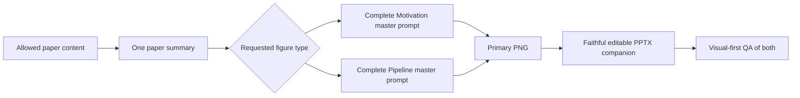

# ResearchFigureSkill

**Current public version: 1.0**

> Paper summary → original prompt template filled without paraphrasing → primary
> style-faithful PNG → faithful editable PPTX companion → visual-first QA.

[中文说明](README.zh-CN.md) · [Changelog](CHANGELOG.md) ·
[Contributing](CONTRIBUTING.md)

Research Figure Compiler creates Motivation and Pipeline figures for the
communication quality expected in leading AI venues such as NeurIPS, ICML,
ICLR, AAAI, CVPR, ACL, and KDD. It targets a clear five-second message,
source-bounded claims, readable text, precise arrows, balanced density,
disciplined alignment, a coherent visual language, and a faithful editable
PowerPoint companion. This is a quality target, not automatic venue
compliance.

## Important usage note

This project can be orchestrated from Codex, Claude Code, and other agentic
coding environments that can read the paper, call an image-generation model,
create or edit PowerPoint files, render previews, and inspect images. Tool
availability differs across environments. When model choice is available,
prefer the latest capable GPT model with strong image generation and visual
reasoning; other agents may still coordinate the workflow, but cannot produce
identical results without equivalent image and presentation tools.

The project is fundamentally a paper-understanding and structure-separation
workflow. Its most important asset is the prompt: it reads the article,
separates the scientific narrative, and fills the original prompt template
without changing its visual-style lock. The complete workflow nevertheless
handles much more than prompt writing: paper summarization, structural
reasoning, content compression, figure generation, scientific and textual
checks, detailed visual review, and an editable PowerPoint companion. This
removes many repetitive manual tasks while preserving a clear review path.

Motivation and Pipeline are deliberately separate products:

- **Motivation** explains why the problem and research need exist.
- **Pipeline** explains how inputs pass through the proposed method to produce
  outputs.

Do not merge them into one overloaded figure. If both are requested, generate
two separate summaries-to-prompt branches and two separate figures. This
separation is a core feature: it reduces prompt complexity, token use,
information overload, and scientific-role confusion.

The current Pipeline template still has a relatively structured
**input → core processing → output** bias. Users needing branches, loops,
multi-agent interactions, training/inference lanes, detailed algorithm
mechanisms, dataset diagrams, comparison figures, or another topology should
state those requirements explicitly. The more specific the desired structure,
the more specific the request should be.

To save tokens and avoid rework, state these items at the beginning:

1. Motivation, Pipeline, or both;
2. whether the paper already has a corresponding figure;
3. if it does, whether to replace it completely, use it as a visual reference
   and improve it, or preserve and repair it;
4. the desired language, venue, aspect ratio, resolution, required content,
   forbidden content, and any special topology.

SVG is not a default deliverable. Repeated tests found that adding an SVG
generation and inspection path created another visual/text synchronization
surface: text and graphics could disagree during review, producing overflow,
collisions, or a final image that differed from the approved design. SVG can
still be requested explicitly, but the recommended outputs are the primary
PNG and a PPTX companion. The PPTX will not perfectly reproduce the PNG's
image-model aesthetics; it is intended as a substantially complete, editable
template for user revision, while the PNG remains the visual source of truth.

This is the current 1.0 design boundary. More flexible compositions, stronger
cross-format fidelity, and additional review capabilities are planned for
future updates.

## State the request first

Users should specify:

1. Motivation, Pipeline, or both;
2. whether the paper already contains the corresponding figure;
3. if yes, whether to completely replace it, use it as a visual/layout
   reference and improve it, or preserve and repair it.

If these choices are missing, the Skill asks one combined question. Complete
replacement strictly ignores the old figure and its caption.

## Compact workflow



The Skill does not create evidence ledgers, FigureSpec files, provenance
bundles, audit JSON, or multi-round review packages by default.

## Prompt templates are the core asset

[`prompt-templates.md`](skills/research-figure/references/prompt-templates.md)
contains the original user-supplied Research Figure Prompt Template plus
Motivation and Pipeline fill cards:

- **Motivation** — status quo → observed limitation → bounded research need;
- **Pipeline** — typed input → 3–7 verb-led stages → typed output.

The fixed formula preserves the original wording and sequence: primary
visual/compositional instruction → scientific topic → exact title and
components → complete scientific narrative → reference-aligned global layout
→ exact region proportions/alignment → Negative Prompt. Its reference-lock
paragraph and base Negative Prompt may not be paraphrased, shortened,
modernized, or reorganized.

The renderer-facing prompt ends after `Negative Prompt`. PowerPoint,
editability, overflow, and reviewer instructions run afterward and are never
mixed into the image prompt.

## Primary PNG plus editable companion

The complete filled prompt directly generates the primary PNG, so one image
model controls the complete visual system: composition, illustration
character, typography hierarchy, icons, borders, arrows, and scientific
narrative. After the PNG passes character-by-character and visual inspection,
a one-slide editable PPTX is reconstructed faithfully from it. Exact text,
numbers, equations, arrows, brackets, braces, and junctions remain editable;
any raster illustration layer is disclosed.

For one figure type, only these files remain:

```text
paper-summary.md
motivation-prompt.md  or  pipeline-prompt.md
motivation.pptx       or  pipeline.pptx
motivation.png        or  pipeline.png
```

SVG is optional only when explicitly requested. Its structural helper remains
available for legacy SVG workflows, but SVG inspection is no longer the
default QA path.

The primary PNG is the aesthetic reference. The rendered PPTX preview is
checked against it for visual fidelity and editability. The PPTX must not
redesign the approved PNG into SmartArt or a generic slide diagram.

## Text overflow and collision safeguards

Post-generation layout and reconstruction safeguards require:

- a 4–6% outer safe area;
- no fixed canvas-occupancy target that forces unnecessary density;
- at least 36 pt slide titles, 26 pt stage titles, 20 pt body labels, and
  18 pt connector labels;
- no figure footnotes or ordinary text below 18 pt;
- normally 3–5 stages and one short label per stage;
- zero equations and callouts by default; at most one of each only when
  indispensable;
- protected title space with no arcs, borders, icons, or connectors;
- content reduction before layout: shorten → remove → move detail to caption →
  change composition → wrap semantically;
- no clipping, masking, cropping, or z-order trick as an overflow fix.

Both the primary PNG and the rendered PPTX preview are visually inspected. A
clean programmatic report does not excuse visible overflow, unexpected
wrapping, border contact, clipping, or collision. Semantic overflow also
fails: if ordinary labels require zooming, the main route competes with
formulas/caveats, or small type is used to preserve a grid, the content or
composition must be reduced.

These safeguards may reduce content or repair geometry, but may not redefine
the original visual system. Rounded dashed semantic regions, exact reference
proportions, hand-lettered headings, simple 2D icons, and the original
orange/blue/green accent language remain primary.

Corporate infographics, polished Nature-style vector art, futuristic AI
interfaces, gradients, shadows, glossy 3D icons, photorealistic objects, and
SmartArt-like redesigns are hard failures.

## Unified native arrows

Every figure declares at most three semantic arrow families, such as primary
flow, secondary action, and dashed supervision. Each family fixes:

- color, opacity, width, and dash;
- arrowhead type, width, and length;
- line cap and join;
- semantic meaning.

The shaft and head are one native PowerPoint connector. Separate triangles are
not used as arrowheads. Endpoints attach to named shape ports; heads match the
shaft, follow its final tangent, and may not show a gap, double outline,
overshoot, or shaft-through-head artifact. Connectors are created before nodes
so routes remain behind labels and objects.

## Visual-first QA

Before delivery, the Skill:

1. inspects every visible word, number, symbol, arrow, and endpoint in the
   primary PNG;
2. runs the presentation overflow test and renders the editable companion;
3. views both PNGs at full size and compares their visual systems;
4. closely inspects the title, text-heavy regions, all connectors/gutters, and
   the four outer edge bands;
5. fixes and rerenders every unintended overflow, wrap, overlap, clipping, or
   broken connector.

The six gates are science, structure, text, aesthetics, optics/layout, and
arrows/editability. A visible defect fails even when metadata passes. The
default stops after the first passing result with at most two targeted repair
rounds.

## Reference handling

If a paper appears to contain a corresponding figure, the Skill asks before
opening it. Users can choose:

- independent replacement;
- reference-led visual/layout improvement;
- preservation and repair.

Complete replacement does not open, OCR, summarize, or pass the old figure or
caption to image generation. Reference-led work may preserve visual grammar,
but never treats the reference as scientific evidence.

Without a reference, the default remains the original design system: white
background, hand-drawn academic infographic style, large black hand-lettered
headings, rounded dashed semantic regions, simple 2D scientific icons,
restrained orange/blue/green accents, clear hand-drawn arrows, and compact but
readable information density.

## Install and update

```bash
gh skill install KaiyiHu/ResearchFigureSkill research-figure \
  --agent codex --scope user
```

Update a tracked installation:

```bash
gh skill update research-figure --dir ~/.codex/skills
```

Manual fallback:

```bash
git clone https://github.com/KaiyiHu/ResearchFigureSkill.git
cp -R ResearchFigureSkill/skills/research-figure ~/.codex/skills/research-figure
```

Reload Codex if an older instruction set remains cached.

## Usage

```text
Use $research-figure to create both Motivation and Pipeline figures. Fill the
complete master prompt formula, generate the primary PNGs, and provide faithful
editable PPTX companions. The paper has no corresponding figures; generate
independently and stop after visual QA passes.
```

```text
Use $research-figure to create only a Pipeline figure. The paper has an
existing Pipeline figure; completely replace it and do not inspect its image
or caption.
```

## Boundaries

- Explicitly excluded source regions are never inspected.
- Exact values, equations, axes, arrows, and final labels are deterministic.
- Private or unpublished material is not sent externally without authorization.
- References constrain visual grammar, not scientific evidence.
- The Skill does not replace scientific, statistical, clinical, or legal
  review.

## License

[MIT](LICENSE)
