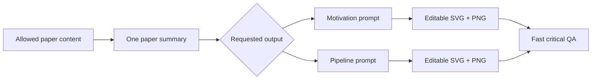

# ResearchFigureSkill

> Summarize the paper, fill a strong prompt template, generate an editable
> motivation and/or pipeline figure, then run one fast critical check.

[中文说明](README.zh-CN.md) · [Changelog](CHANGELOG.md) ·
[Contributing](CONTRIBUTING.md)

The user-facing name is again **Research Figure Compiler**, matching the first
release. The default workflow is deliberately small:



## Two fixed figure types

- **Motivation** — status quo → observed limitation → bounded research need.
- **Pipeline** — typed input → 3–7 named stages → typed output.

The Skill no longer spends time deciding which role “wins”:

- ask for `motivation` and it creates only motivation;
- ask for `pipeline` and it creates only pipeline;
- ask for both, or do not specify, and it creates both.

## Prompt templates are the core asset

[`prompt-templates.md`](skills/research-figure/references/prompt-templates.md)
contains the two production templates. Each template includes:

- the scientific purpose and five-second message;
- exact visible labels and explicit arrow contracts;
- layout and visual-language instructions;
- editable construction requirements;
- a role-specific negative prompt;
- a short preflight checklist.

The agent first writes one useful summary, then fills the selected template.
There is no default evidence-ledger, FigureSpec, role-analysis, provenance, or
audit-JSON stage.

## Minimal default outputs

For one figure type:

```text
paper-summary.md
motivation-prompt.md  or  pipeline-prompt.md
motivation.svg        or  pipeline.svg
motivation.png        or  pipeline.png
```

When both are requested, the same summary is reused. QA is reported in the
response instead of creating another file.

## Fast QA

The generated artifact is inspected once at 100% and once at 200% for:

1. unsupported or invented scientific content;
2. missing components or wrong arrow direction;
3. misspelled, corrupted, or unreadable text;
4. blur, fuzzy/melted shapes, overlap, and clipping;
5. live text and separate editable vector objects.

If a critical gate fails, the agent makes one targeted repair and stops at the
first passing result. The default maximum is two renders.

The optional structural helper is:

```bash
python3 skills/research-figure/scripts/quick_qa.py \
  motivation.svg motivation.png \
  --required-text "Exact label"
```

It checks SVG/XML validity, live text, duplicate IDs, blur filters,
full-canvas raster flattening, required strings, vector geometry, and PNG
dimensions. Visual and scientific inspection still matters.

## Install and update

Install with a recent GitHub CLI:

```bash
gh skill install KaiyiHu/ResearchFigureSkill research-figure \
  --agent codex --scope user
```

Update a tracked installation:

```bash
gh skill update research-figure --dir ~/.codex/skills
```

Manual fallback:

```bash
git clone https://github.com/KaiyiHu/ResearchFigureSkill.git
cp -R ResearchFigureSkill/skills/research-figure ~/.codex/skills/research-figure
```

Manual copies do not carry tracked-update metadata. Reload Codex after install
or update if the old Skill instructions remain cached.

## Usage

Create both figures:

```text
Use $research-figure to summarize this paper, fill the motivation and pipeline
prompt templates, generate both editable figures, and stop after the first
passing critical check.
```

Create only motivation:

```text
Use $research-figure to generate an editable motivation figure for this paper.
Do not inspect the two excluded placeholder captions.
```

Create only pipeline:

```text
Use $research-figure to summarize the paper and generate only the editable
pipeline figure.
```

## Safety boundaries

- Explicitly excluded source regions are never read or used.
- Exact values, equations, axes, and final labels are deterministic.
- Private or unpublished material is not sent to an external provider without
  authorization.
- Reference figures provide only abstract visual attributes, not copied
  scientific content or distinctive expression.
- The Skill does not replace scientific, statistical, clinical, or legal
  review.

## License

[MIT](LICENSE)
