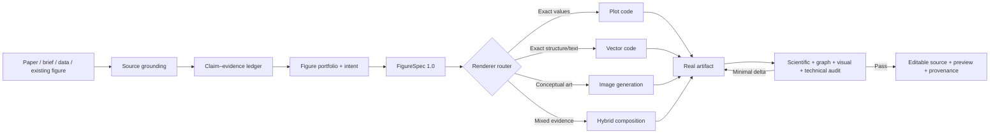

# ResearchFigureSkill

> An evidence-locked scientific visual compiler: paper claims in, auditable figure contracts out.

[中文说明](README.zh-CN.md) · [Market landscape](docs/MARKET_LANDSCAPE_2026.md) · [Validation report](docs/VALIDATION_REPORT.md) · [Changelog](CHANGELOG.md) · [Contributing](CONTRIBUTING.md)

ResearchFigureSkill helps an AI agent decide **what a scientific figure should say before deciding how it should look**. It converts papers, briefs, data, or existing figures into a source-grounded `FigureSpec`, compiles renderer-specific prompts, and audits the real artifact for scientific, structural, and publication risks.

It is deliberately not another “professional, clean, Nature-style” prompt gallery.

## Why it exists

The hard part of research illustration is rarely generating pixels. It is:

- compressing a paper without changing its claim;
- separating **WHY**, **HOW**, and **WHETHER**;
- distinguishing data flow, time, association, causality, feedback, and containment;
- preventing image models from inventing labels, values, equations, or components;
- routing exact plots, editable diagrams, and conceptual illustration to different tools;
- detecting when an attractive figure tells the wrong scientific story.

ResearchFigureSkill makes those decisions explicit and testable.



## What is different

| Common approach | ResearchFigureSkill |
|---|---|
| Full paper → one long image prompt | Source map → role decision → validated intermediate representation |
| Generic “scientific style” | Role-specific scientific argument + bounded style layer |
| One arrow style | Typed edges with claim references |
| One renderer for every figure | Vector / plot / image / hybrid risk routing |
| Overall visual score | Conjunctive hard gates; one false arrow blocks acceptance |
| Repeated full-image regeneration | Stable IDs + minimal revision deltas |
| Final PNG only | Spec, prompt, editable source, audit, and provenance contract |

The project does not claim to outperform dedicated image-generation systems at rendering. It is an upstream reasoning and quality layer that can work with them.

## Core assets

### 1. A staged prompt compiler

The prompt system is versioned and testable:

```text
RF-GROUND-1.0
  → RF-DECIDE-1.0
    → RF-SPECIFY-1.0
      → RF-COMPILE-1.0
        → renderer adapter
          → RF-CRITIQUE-1.0
            → RF-PATCH-1.0
```

Each stage defines accepted inputs, structured outputs, forbidden behavior, failure behavior, and observable checks. See [`prompt-system.md`](skills/research-figure/references/prompt-system.md).

### 2. FigureSpec 1.0

`FigureSpec` separates scientific meaning from visual geometry:

```json
{
  "intent": {
    "role": "mechanism",
    "reader_question": "Why should this component change the outcome?",
    "five_second_message": "A supported intermediate change links intervention to outcome.",
    "claim_boundary": "Do not promote an association to proven causality."
  },
  "claims": [
    {
      "id": "C1",
      "status": "supported",
      "scope": "causal",
      "source_anchor": "§4.2, intervention analysis"
    }
  ],
  "panels": [
    {
      "relations": [
        {
          "from": "intervention",
          "to": "mediator",
          "type": "causal",
          "claim_id": "C1"
        }
      ]
    }
  ]
}
```

The schema and semantic validator catch missing anchors, unknown endpoints, unsupported causal arrows, image-generated quantitative panels, missing epistemic labels, and other high-risk failures.

### 3. Role playbooks

The Skill covers:

- motivation / problem gap;
- method and pipeline;
- mechanism;
- experiment;
- ablation;
- comparison;
- taxonomy;
- graphical abstract;
- deliberate mixed multi-panel figures.

Every playbook defines its reader question, argument grammar, required evidence, forbidden content, prompt adapter, and diagnostic test.

### 4. Renderer routing

- `vector-code`: label- and arrow-heavy diagrams requiring exact structure and editability;
- `plot-code`: values, axes, uncertainty, statistics, and other evidence-bearing geometry;
- `image-generation`: naturalistic or conceptual base art where geometry is not evidence;
- `hybrid`: deterministic evidence layers plus generated illustration assets.

Pure image generation is rejected for experimental and ablation figures.

### 5. Artifact audit

The critic inventories visible components, edges, text, and values, then diffs them against the spec and source. It scores scientific fidelity, structural correctness, role purity, clarity, readability, accessibility, and reproducibility independently. Unsupported claims, reversed arrows, wrong values, or unreadable required labels are blocking failures.

## Install

Preferred: install the latest release with a recent GitHub CLI. This records the
source repository so future updates can be detected:

```bash
gh skill install KaiyiHu/ResearchFigureSkill research-figure \
  --agent codex --scope user
```

Update a tracked installation with:

```bash
gh skill update research-figure --dir ~/.codex/skills
```

Manual fallback:

```bash
git clone https://github.com/KaiyiHu/ResearchFigureSkill.git
cp -R ResearchFigureSkill/skills/research-figure ~/.codex/skills/research-figure
```

Manual copies do not carry GitHub update metadata. Restart or reload Codex if
needed. The Skill can then trigger implicitly or be invoked as
`$research-figure`.

The Skill has no runtime dependency beyond Python 3.9+ for its deterministic workbench. Rendering tools are selected per task and are not silently installed.

## Use

Typical requests:

```text
Use $research-figure to decide whether my Figure 1 should be a motivation
figure or a method overview. Build a claim-evidence map first.
```

```text
Use $research-figure to turn this method section into an editable FigureSpec
and SVG-oriented production prompt. Do not render yet.
```

```text
Use $research-figure to audit this diagram against the paper. List every
claim a reader may infer, flag stronger-than-evidence arrows, and give minimal
revision deltas.
```

```text
用 $research-figure 分析这篇论文的 Figure 1 应该回答什么问题，先输出
证据锚点和 FigureSpec，再决定用 SVG、数据绘图还是图像生成。
```

## Deterministic workbench

Set the path to the installed Skill and use one script:

```bash
SKILL_ROOT="./skills/research-figure"

python "$SKILL_ROOT/scripts/figure_workbench.py" \
  new --role method --out figure-spec.json

python "$SKILL_ROOT/scripts/figure_workbench.py" \
  validate figure-spec.json --strict

python "$SKILL_ROOT/scripts/figure_workbench.py" \
  validate-artifact --kind evidence-ledger evidence-ledger.json --strict

python "$SKILL_ROOT/scripts/figure_workbench.py" \
  compile figure-spec.json --out final-prompt.md

python "$SKILL_ROOT/scripts/figure_workbench.py" \
  audit-template figure-spec.json --out figure-audit.json

python "$SKILL_ROOT/scripts/figure_workbench.py" \
  validate-artifact --kind figure-audit figure-audit.json --spec figure-spec.json

python "$SKILL_ROOT/scripts/figure_workbench.py" \
  check-links --strict
```

The compiler is deterministic: the same validated spec produces the same prompt.

## Examples

The fixtures are synthetic so the repository does not redistribute unpublished or copyrighted papers.

- [`claimcrawl`](examples/claimcrawl/): an overloaded Figure 1 split into a focused motivation figure and a separate method figure;
- [`method-pipeline`](examples/method-pipeline/): a typed pipeline where the source explicitly forbids an invented feedback loop;
- [`quantitative-result`](examples/quantitative-result/): CSV-bound experimental results that must use plot code and must not invent significance.

Each example includes source scope, FigureSpec, compiled prompt, and an audit template; ClaimCrawl also includes a schema-validated evidence ledger.

## Repository layout

```text
ResearchFigureSkill/
├── skills/research-figure/       # Install this directory
│   ├── SKILL.md                  # Lean router and gated workflow
│   ├── agents/openai.yaml        # Codex UI metadata
│   ├── references/               # Prompt system, analysis, roles, QA
│   ├── assets/                   # FigureSpec schema and template
│   └── scripts/figure_workbench.py
├── examples/                     # Synthetic end-to-end fixtures
├── tests/                        # Semantic and regression tests
├── docs/                         # Market and design research
└── .github/workflows/ci.yml
```

The installable Skill intentionally contains no README, changelog, or duplicated quick-reference files. Detailed material is loaded progressively from `references/`.

## Quality gates

Before a figure can pass:

- every supported claim has a source anchor;
- inferred or hypothesized content is visibly labeled;
- every edge has valid endpoints and a semantic type;
- causal edges reference supported causal claims;
- quantitative panels bind a machine-readable data source;
- exact text and numeric geometry use deterministic rendering;
- no critical scientific or structural failure remains;
- scientific fidelity and structural correctness reach 5/5;
- the actual final-size artifact has been inspected;
- editable source, audit, and provenance are available when required.

Default revision budget is three targeted render–audit rounds. If the same major issue fails twice, the workflow escalates instead of claiming publication readiness.

## Tests

```bash
python -m unittest discover -s tests -v
python skills/research-figure/scripts/figure_workbench.py check-links --strict
```

The suite covers deterministic prompt compilation, exact numeric preservation, source anchors, epistemic labels, causal edges, relation endpoints, quantitative routing, Unicode labels, audit inventory, examples, and resource links.

## Market position

The 2025–2026 landscape includes strong end-to-end systems (PaperBanana/PaperVizAgent, SciFig, AutoFigure, AutoFigure-Edit), general scientific Skills, editable reconstruction tools, and plot-code agents. Their best ideas—hierarchical planning, editable output, reference retrieval, multi-critic loops, and reproducibility—inform this project.

The open gap is an evidence-locked reasoning layer that works across motivation, method, mechanism, and result figures. See the dated, source-linked [market landscape](docs/MARKET_LANDSCAPE_2026.md).

## Integrity and privacy

- Never send unpublished papers, reviewer material, patient data, or proprietary inputs to an external provider without authorization.
- Never use generated imagery as experimental evidence.
- Never imitate a reference figure's protected expression wholesale.
- Verify current venue and publisher policies from official sources at submission time.
- Require author/domain-expert approval for scientific interpretation.

See [`integrity-and-venues.md`](skills/research-figure/references/integrity-and-venues.md) and [SECURITY.md](SECURITY.md).

## License

MIT. See [LICENSE](LICENSE).
