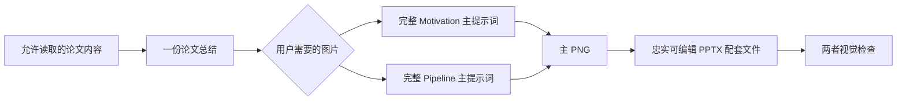

# ResearchFigureSkill

**当前公开版本：1.0**

> 论文总结 → 原始提示词模板原句填充、不改写 → 风格统一的主 PNG →
> 忠实可编辑 PPTX 配套文件 → 双重视觉检查。

[English](README.md) · [版本记录](CHANGELOG.md) ·
[贡献指南](CONTRIBUTING.md)

Research Figure Compiler 面向 NeurIPS、ICML、ICLR、AAAI、CVPR、ACL、KDD
等 AI 顶会论文所需要的科研表达质量：五秒内看懂核心信息、主张不超过论文证据、
文字清楚、箭头准确、密度均衡、对齐严谨、视觉语言统一，并保留忠实可编辑的
PowerPoint 配套文件。这是质量目标，不代表自动满足某个会议的最新投稿规范。

## 额外注意事项（使用前请阅读）

本项目可由 Codex、Claude Code，以及其他能够读取论文、调用生图模型、创建或编辑
PowerPoint、渲染预览并检查图片的智能体环境执行。不同环境提供的工具并不完全
一致；如果可以选择模型，建议优先使用具备较强图像生成和视觉推理能力的最新 GPT
模型。其他智能体也可以负责组织工作流，但如果缺少等价的生图、PPT 和视觉检查
工具，最终效果不一定一致。

本项目本质上是一套“读懂论文并分清科研结构”的工作流，最重要的资产仍然是
Prompt：先理解文章、拆分科学叙事，再在不改写视觉风格锁定段的前提下填入原始
提示词模板。但完整工作流并不只是写 Prompt，它还会完成论文总结、结构理清、
内容压缩、生图、科学与文字检查、细致的视觉审查，以及可编辑 PowerPoint 配套
文件，从而省去大量重复而繁琐的人工任务，并保留清晰的审查路径。

Motivation 和 Pipeline 是刻意分开的两类产品：

- **Motivation** 回答为什么存在这个问题，以及为什么需要这项研究；
- **Pipeline** 回答输入如何经过方法的核心处理得到输出。

不要把两者混进同一张信息过载的图片。如果用户两张都需要，应分别生成两条
“总结 → Prompt → 图片”分支和两张独立配图。分开处理是本项目的核心卖点之一：
它能减少提示词复杂度、Token 消耗、信息过载和科学角色混淆。

当前 Pipeline 模板仍然偏向比较结构化的
**输入 → 核心处理 → 输出** 三段式表达。若需要分支、循环、多智能体交互、
训练/推理双通道、细致算法机制、数据集图、对比图或其他拓扑，请在请求中明确
写出；要求越细致，用户越应该提前说明希望看到的结构。

为了节省 Token 并避免返工，建议在开始时一次说清：

1. 要 Motivation、Pipeline，还是两张都要；
2. 原论文是否已有对应图片；
3. 如果有，是完全替换、仅参考视觉后改进，还是保留并修复；
4. 希望使用的语言、会议风格、画幅、分辨率、必须出现/禁止出现的内容，以及
   特殊结构要求。

SVG 不是默认交付格式。多次试验发现，引入 SVG 生成与检查会额外增加一层视觉和
文字同步界面：审查阶段可能出现文字与图形不一致，最终导致溢出、图文冲突，或
导出的图片偏离已经通过的设计。因此仍可在用户明确要求时输出 SVG，但推荐交付
主 PNG 和 PPTX 配套文件。PPTX 无法完全复现 PNG 中由生图模型产生的视觉效果，
它的定位是一个内容比较完整、便于用户继续修改的可编辑模板；视觉效果仍以 PNG
为准。

以上是当前 1.0 的能力边界。更灵活的构图、更高的跨格式一致性和更强的审查能力
将在后续版本中继续完善，敬请期待。

## 使用前先说明需求

用户应提前说明：

1. 要 Motivation、Pipeline，还是两张都要；
2. 原论文是否已有对应图片；
3. 如果有，是完整替换、依照其视觉/布局改进，还是保留并修复。

缺少决定时，Skill 只问一个合并问题。选择完整替换后，旧图和图注都不得作为
参考。

## 精简工作流



默认不生成证据账本、FigureSpec、provenance、审计 JSON 或多轮评审包。

## 核心资产：提示词模板

[`prompt-templates.md`](skills/research-figure/references/prompt-templates.md)
包含用户原始 Research Figure Prompt 模板，以及 Motivation、Pipeline 两套填充卡：

- **Motivation**：现状 → 已观察到的局限/盲点 → 有边界的研究需求；
- **Pipeline**：有类型的输入 → 3–7 个动词驱动阶段 → 有类型的输出。

固定公式完整保留原始措辞和顺序：主视觉/参考图指令 → 科学主题 → 精确标题与组件
→ 完整科学叙事 → 与参考图对齐的全局布局 → 精确区域比例与对齐 → Negative
Prompt。参考图锁定段和基础 Negative Prompt 不允许转述、缩短、现代化或重新组织。

真正发送给生图模型的 Prompt 到 `Negative Prompt` 为止。PPT、可编辑性、溢出和
审稿检查全部在生图之后执行，绝不再混入生图 Prompt。

## 主 PNG 与可编辑配套文件

默认把完整主提示词直接交给生图模型生成整张主 PNG，让同一个视觉系统统一控制
构图、插画、字体层级、图标、边框、箭头和科学叙事。主 PNG 逐字和视觉检查通过后，
再以它为准忠实重建一页可编辑 PPTX。精确文字、数字、公式、箭头、括号、花括号
和连接点保持可编辑；若有栅格插画层会如实说明。

生成一种图时只保留：

```text
paper-summary.md
motivation-prompt.md  或  pipeline-prompt.md
motivation.pptx       或  pipeline.pptx
motivation.png        或  pipeline.png
```

SVG 仅在用户明确要求时输出，也不再作为默认检查对象。主 PNG 是审美基准，PPTX
渲染预览是忠实度和可编辑性基准。PPTX 不得把已经通过的主 PNG 重新设计成
SmartArt 或普通幻灯片流程图。

## 文字溢出与冲突规范

生图后的布局和 PPT 重建阶段强制要求：

- 画布四周保留 4–6% 安全区；
- 不再设置“必须占满多少画布”的密度比例；
- 主标题至少 36 pt、阶段标题至少 26 pt、正文标签至少 20 pt、箭头标签至少
  18 pt；
- 禁止小于 18 pt 的普通文字和图内脚注；
- Pipeline 默认 3–5 阶段，每个阶段只留一个短标签；
- 公式和 callout 默认都不显示，只有不可缺少时才各允许一个；
- 标题拥有独立保护区，弧线、边框、图标和连接器不得进入；
- 溢出处理顺序是：缩短 → 删除非必要内容 → 把细节移到图注 →
  更换构图 → 按语义换行；
- 不允许用裁切、遮罩、裁剪或图层覆盖假装解决溢出。

主 PNG 与 PPTX 渲染预览都必须检查。即使程序没有报错，只要任一版本肉眼可见
溢出、异常换行、贴边、裁切或冲突，就必须判失败。即使文字没有超出边框，只要
普通标签需要放大才能看清、主流程被公式/限定语抢占，或为了保留网格而使用小字，
也属于“信息溢出”，必须删减内容或更换构图。

这些规则可以删减内容或修复几何问题，但不能重新定义原始视觉系统。彩色虚线圆角
区域、参考图精确比例、手写式标题、简单 2D 图标以及橙/蓝/绿强调色保持优先。

企业信息图、精致 Nature 风矢量图、未来 AI 界面、渐变、阴影、光泽 3D 图标、
写实物体和 SmartArt 式重新设计全部属于硬性失败。

## 统一的原生箭头

每张图最多声明三类语义箭头，例如主流程、次级动作和虚线监督。每个 token 固定：

- 颜色、透明度、线宽和虚实；
- 箭头形状、宽度和长度；
- 线帽、折线连接形式和语义。

箭头头部和线身必须是同一个 PowerPoint 原生连接器，禁止用独立三角形拼接。
两端连接到命名端口；箭头头部与线身颜色一致、沿末段切线衔接，不得出现断口、
双描边、线穿过箭头头、过冲或悬空。先创建连接器，再创建节点，保证连线位于
对象和文字下方。

## 视觉优先 QA

交付前必须：

1. 逐字检查主 PNG 的文字、数字、符号、箭头和端点；
2. 运行 PPT 溢出检测并渲染可编辑配套文件；
3. 原尺寸查看两个 PNG，并比较其视觉系统是否一致；
4. 放大检查标题、文字密集区域、全部连接器/面板间通道和画布四边；
5. 修复所有非预期溢出、换行、重叠、裁切和断裂连接器后重新渲染。

六项门槛为：科学、结构、文字、审美、视觉/布局、箭头/可编辑性。视觉问题优先于
“程序通过”。默认第一次通过后立即停止，最多进行两轮针对性修复。

## 原论文图片的处理

发现对应原图时，Skill 会在打开前询问：

- 完全独立替换；
- 只参考视觉/布局后改进；
- 保留并修复。

完整替换时，不打开、不 OCR、不总结旧图或图注，也不把它们传给生图工具。
参考模式只能约束视觉语法，不能作为科学证据。

无参考图时默认采用手绘学术信息图：白纸背景、略带手绘感的黑线、彩色虚线区域、
手写式标题、科研涂鸦插画、少量淡色强调和紧凑但可读的信息密度。

## 安装与升级

```bash
gh skill install KaiyiHu/ResearchFigureSkill research-figure \
  --agent codex --scope user
```

升级：

```bash
gh skill update research-figure --dir ~/.codex/skills
```

手动备用方式：

```bash
git clone https://github.com/KaiyiHu/ResearchFigureSkill.git
cp -R ResearchFigureSkill/skills/research-figure ~/.codex/skills/research-figure
```

若仍加载旧说明，请重新加载 Codex。

## 使用示例

```text
用 $research-figure 生成 Motivation 和 Pipeline 两张科研图。完整填入主提示词
公式，先生成主 PNG，再交付忠实可编辑 PPTX 配套文件。原论文没有对应图片，请
独立生成并在双重视觉检查通过后停止。
```

```text
用 $research-figure 只生成 Pipeline。原论文有旧图，但请完整替换，不要查看旧图
和图注。
```

## 边界

- 用户明确排除的材料不检查；
- 数值、公式、坐标轴、箭头和最终文字确定性生成；
- 未经授权不把未公开材料发送给外部服务；
- 参考图只能约束视觉语法，不能提供科学证据；
- 不能替代领域专家、统计、临床或法律审查。

## License

[MIT](LICENSE)
