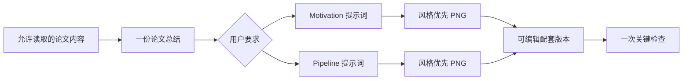

# ResearchFigureSkill

> 总结论文 → 填入固定提示词模板 → 生成可编辑 Motivation / Pipeline 图 →
> 做一次关键检查。

[English](README.md) · [版本记录](CHANGELOG.md) ·
[贡献指南](CONTRIBUTING.md)

用户界面名称已恢复为第一版的 **Research Figure Compiler**。默认流程不再走
证据账本、角色判断、FigureSpec、多轮审计和 provenance 全家桶，而是：



## 两种固定类型

- **Motivation**：现状 → 已观察到的局限/盲点 → 有边界的研究需求。
- **Pipeline**：有类型的输入 → 3–7 个明确阶段 → 有类型的输出。

这里不再判断哪一种“更适合”：

- 用户指定 `motivation`，只生成 Motivation；
- 用户指定 `pipeline` / method / workflow，只生成 Pipeline；
- 用户指定两张，或没有指定类型，默认两张都生成。

## 核心资产：提示词模板

[`prompt-templates.md`](skills/research-figure/references/prompt-templates.md)
提供两套可直接填充的生产模板，包含：

- 科学目的、五秒信息和主张边界；
- 必须出现的精确文字与逐条箭头合同；
- 布局、视觉语言和可编辑构建要求；
- 针对 Motivation / Pipeline 的负面提示词；
- 简短的渲染前检查。

Agent 只需先写一份可靠的论文总结，再填入用户需要的模板，不再默认生成
`evidence-ledger.json`、`figure-role-analysis.md`、`figure-spec.json`、
`provenance.json` 或 `figure-audit.json`。

## 参考图风格与生成顺序

用户提供目标示例时，Skill 会把它当作**主要视觉与构图参考**，锁定其分区比例、
虚线边框、手写字体气质、图标语言、箭头节奏、配色方式和信息密度，同时替换参考
图中的论文内容、文字、数值、Logo 与专属符号。

有参考图时默认先走 image-first：把填好的完整提示词和参考图直接交给图像模型，
先得到风格一致的 PNG。用户要求可编辑时，再据此制作带 live text、独立边框和
箭头的 SVG 配套版本；若其中仍保留栅格插画层，会如实说明，不会把混合文件称为
“完全矢量”。

没有参考图时，默认采用白纸背景、彩色虚线分区、手写式标题、黑线科研图标和
紧凑信息密度的手绘学术信息图，不再默认生成 SaaS 仪表盘或等宽企业卡片。

## 默认只保留必要文件

生成一种图时：

```text
paper-summary.md
motivation-prompt.md  或  pipeline-prompt.md
motivation.svg        或  pipeline.svg
motivation.png        或  pipeline.png
```

生成两种图时共用同一份总结。检查结果直接写在回复中，不再单独保存 QA 文件。

## 快速关键检查

真实产物只做一次 100% 和一次 200% 检查：

1. 是否出现论文没有支持的主张、数值或模块；
2. 组件是否齐全、流程顺序与箭头方向是否正确；
3. 是否有错字、伪文字、缺字或不可读字体；
4. 是否有图形虚化、模糊、融化、重叠或裁切；
5. SVG 是否保留 live text 和独立可编辑对象。

提供参考图时，若分区、边框、字体气质、图标、箭头、配色或密度已经漂移到另一种
视觉风格，也视为检查失败。

若关键项失败，只做一次针对性修复；第一次通过后立即停止。默认最多两次渲染，
不把时间耗在无关的反复润色上。

可选的轻量结构检查：

```bash
python3 skills/research-figure/scripts/quick_qa.py \
  motivation.svg motivation.png \
  --required-text "Exact label"
```

它检查 SVG/XML、live text、重复 ID、模糊滤镜、整图栅格化、必需文字、矢量
对象和 PNG 尺寸；科学含义与视觉质量仍需查看真实预览。

只有在明确披露“插画层仍为栅格、文字和结构覆盖层可编辑”的 image-first 混合
SVG 中才使用 `--allow-hybrid`，不能借此把扁平图片称为完全可编辑。

## 安装与升级

使用较新的 GitHub CLI 安装：

```bash
gh skill install KaiyiHu/ResearchFigureSkill research-figure \
  --agent codex --scope user
```

升级已追踪安装：

```bash
gh skill update research-figure --dir ~/.codex/skills
```

手动安装备用方式：

```bash
git clone https://github.com/KaiyiHu/ResearchFigureSkill.git
cp -R ResearchFigureSkill/skills/research-figure ~/.codex/skills/research-figure
```

手动复制不会保存上游更新信息。若仍加载旧说明，安装或升级后重新加载 Codex。

## 使用示例

默认生成两张：

```text
用 $research-figure 总结这篇论文，分别填入 Motivation 与 Pipeline
提示词模板，生成两张可编辑科研图，并在第一次关键检查通过后停止。
```

只生成 Motivation：

```text
用 $research-figure 为这篇论文只生成可编辑 Motivation 图。
不要读取两张占位图下方被排除的解释。
```

只生成 Pipeline：

```text
用 $research-figure 总结论文，并只生成可编辑 Pipeline 图。
```

## 边界

- 用户明确排除的页面、图片或图下注释不读取、不使用；
- 数值、公式、坐标轴、箭头和最终文字使用确定性图层；
- 未经授权不把未公开材料发送给外部服务；
- 参考图负责约束视觉语法，但不提供科学证据；其文字、数值、Logo 和论文专属
  符号必须替换；
- 不能替代领域专家、统计、临床或法律审查。

## License

[MIT](LICENSE)
