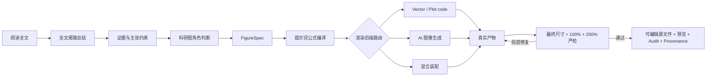

# ResearchFigureSkill

> 一个以提示词为核心、由证据约束的科研视觉编译器：先理解全文，再编译可审计的生产提示词，渲染后检查真实产物，最终交付可编辑源文件。

[English](README.md) · [市场调研](docs/MARKET_LANDSCAPE_2026.md) · [验证报告](docs/VALIDATION_REPORT.md) · [版本记录](CHANGELOG.md) · [贡献指南](CONTRIBUTING.md)

ResearchFigureSkill 不是“简洁、专业、Nature 风格”提示词合集。它的核心资产是
一套可复现的 Prompt Engineering 流程：先对全文做细致总结，再把证据、图的角色、
科学叙事和视觉约束编译成可供不同绘图后端直接执行的生产提示词。

默认流程是：



## 为什么要这样做

科研绘图最难的部分不是让 AI “画一张漂亮的科研图”，而是判断：

- 论文真正证明了什么，包括负面证据、适用范围和局限；
- 这张图应该回答 **WHY、HOW 还是 WHETHER**；
- 哪些标签、数值、公式、实体和关系必须逐字准确；
- 箭头表示数据流、时间、相关、因果、反馈还是包含；
- 哪些内容必须由确定性的矢量代码或数据代码绘制；
- 图像模型可以画什么，但不能把什么伪装成科研证据；
- 真实导出图中是否存在错字、伪文字、局部虚化、模糊边缘、图形融化、
  重影、裁切或低分辨率图层。

ResearchFigureSkill 把这些判断变成显式、可测试、可局部修复的契约。

## 与常见方案的区别

| 常见方案 | ResearchFigureSkill 2.0 |
|---|---|
| 论文全文直接变成一段即兴 Prompt | 全文总结 → 证据约束 → 角色判断 → 编译后的 Prompt |
| 用 Prompt 长度衡量质量 | 十二个具名合同字段 + 确定性 lint |
| 依赖“科研风、简洁、专业”等形容词 | 科学叙事优先，风格只是受约束的一层 |
| 所有箭头一种含义 | typed relation + claim + source anchor |
| 一种模型画所有图 | vector / plot / image / hybrid 风险路由 |
| 看到一张漂亮预览就结束 | 检查最终尺寸、100% 和 200% 的真实产物 |
| 每轮整图重新抽卡 | 稳定 ID + 最小局部修复 delta |
| 最终只保留 PNG | 可编辑源文件、预览、Prompt、Audit 和 Provenance |

本项目不替代图像生成器、矢量编辑器或数据绘图工具；它是协调这些工具的上游
论文理解、提示词编译与质量门禁层。

## 核心资产：提示词公式

每一份生产提示词都由同一套显式公式编译：

```text
P = J + R + S + N + C + E + L + V + D + X + O + Q
```

| 字段 | 合同 |
|---|---|
| `J` | 任务、投稿目标、媒介、画布和交付物 |
| `R` | 参考图合同：允许借鉴哪些抽象属性、禁止复制什么 |
| `S` | 科学主题、用途、读者问题和主张边界 |
| `N` | 有证据支持的视觉叙事与五秒信息 |
| `C` | 必须、可选、禁止内容以及精确文字 |
| `E` | 关系类型、箭头方向、边标签和认识状态 |
| `L` | 全局布局、阅读顺序、panel 和归一化区域几何 |
| `V` | 视觉语言、层级、配色、字体和无障碍要求 |
| `D` | 确定性与可编辑构建说明 |
| `X` | 角色、证据、参考图、渲染器与光学缺陷的负面约束 |
| `O` | 输出格式、可编辑源文件、预览、尺寸与 provenance |
| `Q` | 渲染前检查和渲染后验收 |

最终生产提示词共有 13 个章节，因为 `L` 会进一步拆成“全局布局”和“逐 panel
构图”两节。

这不是一个只靠填空的风格 Prompt。每个字段都必须由论文全文总结、证据账本、
角色分析和通过校验的 `FigureSpec` 编译而来。参考图只允许提供抽象布局和视觉
属性，不能代替科学证据，也不能授权对原图进行整体仿制。

核心文件：

- [`prompt-formula.md`](skills/research-figure/references/prompt-formula.md)：
  完整公式、渲染器适配器、负面提示词编译和 lint 规则；
- [`paper-summary.template.md`](skills/research-figure/assets/paper-summary.template.md)：
  全文细致总结合同；
- [`final-prompt.template.md`](skills/research-figure/assets/final-prompt.template.md)：
  可直接交给渲染器的最终提示词结构；
- [`prompt-system.md`](skills/research-figure/references/prompt-system.md)：
  各阶段提示词、失败行为和验收规则。

版本化编译链为：

```text
RF-SUMMARIZE-2.0
→ RF-GROUND-1.0
→ RF-DECIDE-1.0
→ RF-SPECIFY-1.0
→ RF-COMPILE-2.0
→ renderer adapter
→ RF-CRITIQUE-2.0
→ RF-PATCH-2.0
```

## 必须先完成全文细致总结

在规划 Figure 1 前，工作流必须记录：

- 问题、缺口、核心论点、贡献和完整方法；
- 适用时的训练与推理行为；
- 实验设计、精确的关键结果、不确定性和负面结果；
- 局限、适用范围、伦理问题和尚未解决的问题；
- 精确术语与章节覆盖表；
- 哪些科学信息属于 Figure 1，哪些应留给后续图或表。

用户要求排除的内容是硬边界。被要求跳过的图注、补充材料或占位图不能被悄悄
当作证据使用。

## FigureSpec 与渲染路由

`FigureSpec` 把科学语义与视觉几何分开，记录 reader question、five-second
message、claim boundary、source anchor、精确文字、typed relation、视觉层级、
渲染器、可编辑要求和验收项。

- `vector-code`：精确标签、箭头、几何与可编辑示意图；
- `plot-code`：数值、坐标轴、不确定性、统计量与证据性几何；
- `image-generation`：几何和文字不承载证据的概念性或自然场景底图；
- `hybrid`：图像生成素材位于底层，确定性文字、箭头、数据图与注释位于上层。

实验和消融证据不能交给纯图像生成。图像型科研图的安全默认方案是：先生成
无文字底图，再用确定性的 live text 和矢量图层叠加标签与关系。

## 对真实产物进行光学严检

Prompt 不是最终交付物。`RF-CRITIQUE-2.0` 要求记录对真实导出文件的检查，
并在需要时记录对可编辑源文件的检查：

| 检查层级 | 阻断性缺陷 |
|---|---|
| 最终投稿尺寸 | 标签不可读、层级失效、细节坍缩 |
| 100% 视图 | 错误字体或字形、伪文字、标签不一致、重叠、裁切 |
| 200% 视图 | 局部虚化、模糊边缘、图形融化、重影、文字栅格化 |
| 源文件检查 | 缺少 live text、证据图层被压平、稳定 ID 损坏 |
| 分辨率检查 | 低分辨率素材、放大插值、压缩伪影 |

美观分不能抵消科学或结构硬错误。必须文字必须逐字一致；只要必要图形仍然
模糊、损坏、被裁切，或在要求可编辑时不可编辑，就不能判定通过。

仓库内的 `inspect-svg` 只是确定性的 SVG 结构预检，不能代替查看真实渲染
像素。PPTX、draw.io 与 PDF 源文件必须使用对应原生软件或文档工具打开检查。
完成的审计会用文件路径与 SHA-256 绑定实际检查对象。

## 安装与升级

推荐使用较新版本的 GitHub CLI 安装最新 Release。该方式会记录上游仓库，
以后可以检测更新：

```bash
gh skill install KaiyiHu/ResearchFigureSkill research-figure \
  --agent codex --scope user
```

升级已追踪的安装：

```bash
gh skill update research-figure --dir ~/.codex/skills
```

手动安装备用方式：

```bash
git clone https://github.com/KaiyiHu/ResearchFigureSkill.git
cp -R ResearchFigureSkill/skills/research-figure ~/.codex/skills/research-figure
```

手动复制不会附带 GitHub 更新元数据。必要时重启或重新加载 Codex。随后可以
显式调用 `$research-figure`，也可由 Codex 根据科研绘图任务自动触发。

确定性工作台需要 Python 3.9+。渲染工具按任务选择，不会被静默安装。

## 使用示例

一个完整请求可以很简单：

```text
用 $research-figure 阅读这篇论文全文，先生成细致总结和主张—证据映射，
判断 Figure 1 的角色并编译最终生产提示词，然后生成可编辑科研配图。
严格检查真实产物中的错误字体、伪文字、局部虚化、模糊、图形融化、重影、
裁切和低分辨率图层。不要把两张占位图的图下解释作为证据。
```

也可以只规划或只审计：

```text
用 $research-figure 总结全文，判断 Figure 1 应该是 motivation 还是 method，
生成 FigureSpec 与最终提示词，但暂时不要渲染。
```

```text
用 $research-figure 对照论文和 FigureSpec 审计这个 SVG，只返回有证据支持的
最小修复 delta。
```

## 确定性命令行工作台

```bash
SKILL_ROOT="./skills/research-figure"

python3 "$SKILL_ROOT/scripts/figure_workbench.py" \
  new --role method --out figure-spec.json

python3 "$SKILL_ROOT/scripts/figure_workbench.py" \
  validate figure-spec.json --strict

python3 "$SKILL_ROOT/scripts/figure_workbench.py" \
  compile figure-spec.json --summary paper-summary.md --out final-prompt.md

# 检查章节顺序、未替换占位符、精确文字、关系、负面约束、
# 可编辑要求和输出合同。
python3 "$SKILL_ROOT/scripts/figure_workbench.py" \
  lint-prompt final-prompt.md --spec figure-spec.json \
  --summary paper-summary.md --strict

# 仅针对 SVG 的结构预检：可见 live text、字体声明、滤镜、
# 栅格原生尺寸、稳定 ID 与精确标签覆盖。
python3 "$SKILL_ROOT/scripts/figure_workbench.py" \
  inspect-svg figure.svg --spec figure-spec.json --strict

python3 "$SKILL_ROOT/scripts/figure_workbench.py" \
  audit-template figure-spec.json --out figure-audit.json

python3 "$SKILL_ROOT/scripts/figure_workbench.py" \
  validate-artifact --kind figure-audit figure-audit.json \
  --spec figure-spec.json --strict

python3 "$SKILL_ROOT/scripts/figure_workbench.py" \
  check-links --strict
```

同一份通过校验的全文总结与 FigureSpec 会稳定编译出同一份生产提示词，
并写入一致的总结 SHA-256。

## 示例与测试

示例均为合成材料，仓库不会重新分发未发表或受版权保护的论文：

- [`claimcrawl`](examples/claimcrawl/)：全文总结、角色拆分、证据账本，以及
  分开的 motivation 与 method 合同；
- [`method-pipeline`](examples/method-pipeline/)：展示 typed relation，并明确
  阻止模型虚构反馈回路；
- [`quantitative-result`](examples/quantitative-result/)：CSV 绑定的数据图，
  必须使用 plot code 且禁止虚构显著性。

```bash
python3 -m unittest discover -s tests -v
python3 skills/research-figure/scripts/figure_workbench.py check-links --strict
```

## 市场定位

2025–2026 年的 PaperBanana/PaperVizAgent、SciFig、AutoFigure、
AutoFigure-Edit 等端到端系统，以及科研绘图 Skill、可编辑重建工具和数据绘图
Agent，已经在层级规划、参考检索、可编辑输出、多 critic 循环与可复现性方面
提供了重要经验。

仍然缺少的是：一套以提示词模板为核心、由证据约束、覆盖 motivation、
method、mechanism 与 results，并且会检查真实产物而不止停在 Prompt 生成阶段
的工作流。这就是本项目的差异化位置。完整竞品工作量、质量和局限对比见
[2026 市场调研](docs/MARKET_LANDSCAPE_2026.md)。

## 边界

- 不把生成图像当作实验数据。
- 未经授权，不把未发表论文、审稿材料、患者数据或内部数据发送给外部服务。
- 不从风格参考图或用户明确排除的区域推断科学主张。
- 不整体模仿参考图受保护的独特表达，只抽取被允许的抽象布局与视觉属性。
- 投稿前从官方来源核验当前 venue 和出版社规则。
- 最终科学解释仍需作者或领域专家确认。

详见 [`integrity-and-venues.md`](skills/research-figure/references/integrity-and-venues.md)
与 [SECURITY.md](SECURITY.md)。

## License

MIT，见 [LICENSE](LICENSE)。
